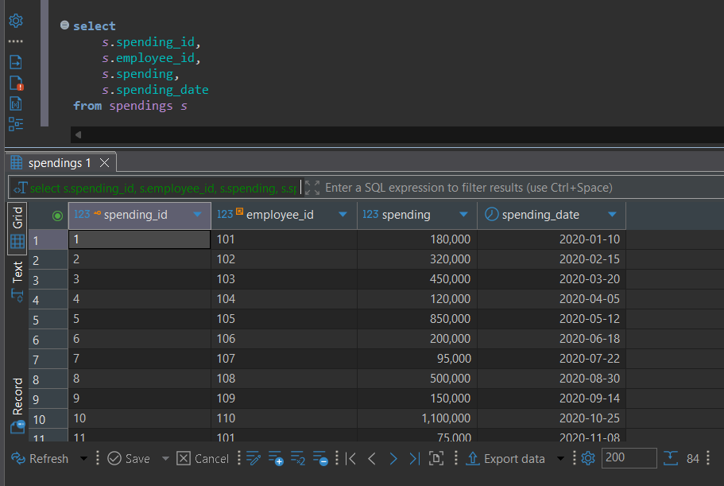

### Select Table Employees

### Select Table Departments

### Select Table Spendings

### Select Table Roles

---

### Query untuk Mendapatkan Kolom Employee Name, Department Name, Spending Value, dan Spending Date

Query ini menggunakan **INNER JOIN** untuk menggabungkan tabel-tabel yang memiliki nilai yang match, serta menggunakan **WHERE** dengan klausa **BETWEEN** untuk memfilter data berdasarkan rentang waktu.

